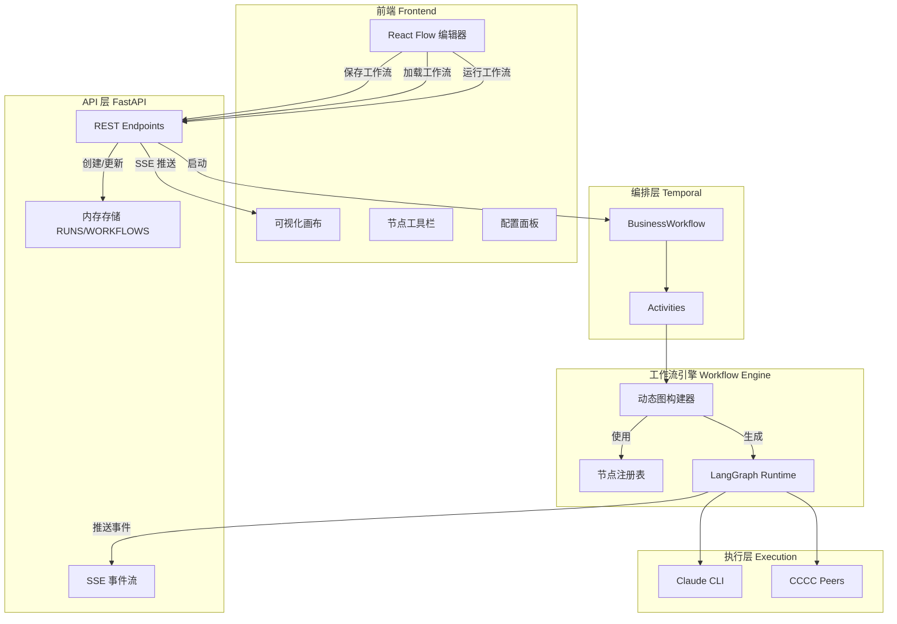
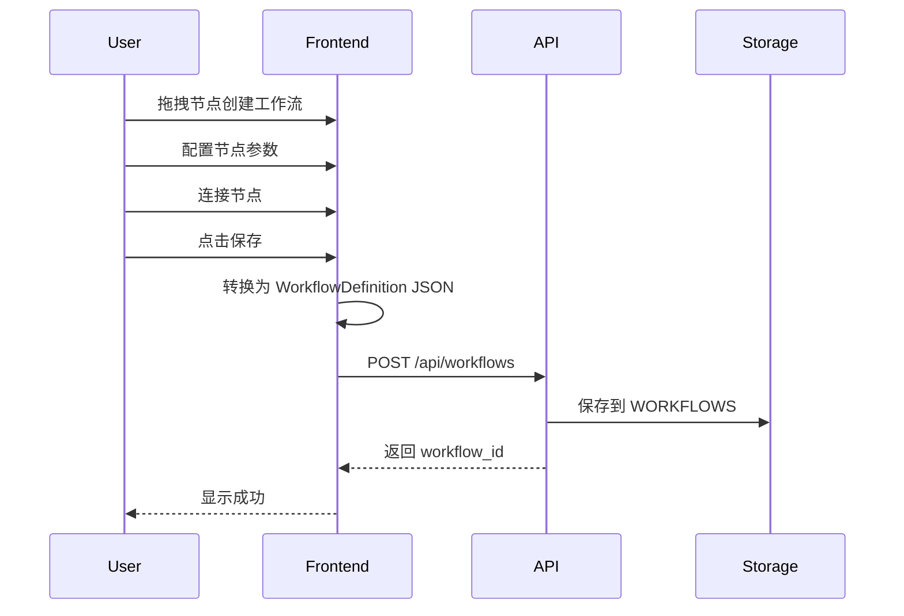
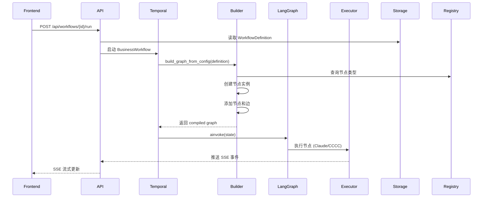

# 动态工作流编排平台 - 技术设计文档

**版本**: 1.0
**作者**: domain-expert
**日期**: 2026-01-31
**状态**: Draft

---

## 目录

1. [概述](#1-概述)
2. [架构设计](#2-架构设计)
3. [数据模型](#3-数据模型)
4. [API 定义](#4-api-定义)
5. [前后端接口](#5-前后端接口)
6. [实施计划](#6-实施计划)
7. [风险与缓解](#7-风险与缓解)

---

## 1. 概述

### 1.1 背景

当前系统使用硬编码的工作流定义（graph.py 中固定的 5 个节点），无法满足用户自定义工作流的需求。本设计文档描述如何将系统升级为动态可视化编排平台。

### 1.2 设计目标

1. **动态性**: 用户可通过前端可视化编辑器创建、编辑工作流
2. **向后兼容**: 现有硬编码工作流继续可用
3. **渐进式演进**: 保留现有架构 80%，新增动态层
4. **可扩展性**: 支持未来添加新节点类型、条件分支、循环等高级特性

### 1.3 核心变化

| 维度 | 当前 (MVP) | 目标 (Platform) |
|------|-----------|-----------------|
| 工作流定义 | 硬编码 (graph.py) | 用户自定义 (JSON) |
| 节点类型 | 固定 5 个节点 | 可扩展节点注册表 |
| 图构建 | 静态编译 | 动态构建引擎 |
| 存储 | 内存 (RUNS dict) | 内存 + 备用数据库 schema |
| 前端 | 只读画布 | 编辑模式 + 节点工具栏 |

---

## 2. 架构设计

### 2.1 系统架构图



### 2.2 核心组件

#### 2.2.1 节点注册表 (Node Registry)

**职责**: 管理可用节点类型，支持动态注册和实例化

**设计**:
```python
# workflow/node_registry.py

from typing import Protocol, Dict, Any, Callable
from dataclasses import dataclass

@dataclass
class NodeDefinition:
    """节点定义"""
    id: str
    type: str  # 节点类型: llm_agent, cccc_peer, conditional, etc.
    label: str
    config: Dict[str, Any]
    position: Dict[str, float]  # {x: float, y: float}

class BaseNode(Protocol):
    """节点基类协议"""
    async def execute(self, state: Dict[str, Any]) -> Dict[str, Any]:
        """执行节点逻辑"""
        ...

# 全局注册表
_NODE_TYPES: Dict[str, type[BaseNode]] = {}

def register_node_type(type_name: str):
    """注册节点类型的装饰器"""
    def decorator(cls: type[BaseNode]):
        _NODE_TYPES[type_name] = cls
        return cls
    return decorator

def get_node_class(type_name: str) -> type[BaseNode]:
    """获取节点类"""
    if type_name not in _NODE_TYPES:
        raise ValueError(f"Unknown node type: {type_name}")
    return _NODE_TYPES[type_name]

def create_node(definition: NodeDefinition) -> BaseNode:
    """根据定义创建节点实例"""
    cls = get_node_class(definition.type)
    return cls(definition.config)

def list_available_node_types() -> List[Dict[str, Any]]:
    """列出可用节点类型（供前端使用）"""
    return [
        {
            "type": type_name,
            "label": cls.__doc__ or type_name,
            "config_schema": getattr(cls, "config_schema", {})
        }
        for type_name, cls in _NODE_TYPES.items()
    ]
```

#### 2.2.2 动态图构建器 (Dynamic Graph Builder)

**职责**: 从 JSON 工作流定义动态构建 LangGraph

**设计**:
```python
# workflow/dynamic_graph.py

from dataclasses import dataclass
from typing import List, Dict, Any, Optional
from langgraph.graph import StateGraph, END
from .node_registry import NodeDefinition, create_node

@dataclass
class EdgeDefinition:
    """边定义"""
    source: str  # 源节点 ID
    target: str  # 目标节点 ID
    condition: Optional[str] = None  # 条件表达式 (Phase 4)

@dataclass
class WorkflowDefinition:
    """工作流定义"""
    id: str
    name: str
    description: str
    nodes: List[NodeDefinition]
    edges: List[EdgeDefinition]
    entry_point: str  # 入口节点 ID

class DynamicGraphBuilder:
    """动态图构建器"""

    def __init__(self, workflow_def: WorkflowDefinition, state_schema: type):
        self.workflow_def = workflow_def
        self.state_schema = state_schema
        self.nodes = {}  # node_id -> node_instance

    def build(self) -> StateGraph:
        """构建 LangGraph"""
        graph = StateGraph(self.state_schema)

        # 1. 创建所有节点实例
        for node_def in self.workflow_def.nodes:
            node_instance = create_node(node_def)
            self.nodes[node_def.id] = node_instance

            # 将节点添加到图中
            graph.add_node(node_def.id, self._wrap_node(node_instance))

        # 2. 设置入口点
        graph.set_entry_point(self.workflow_def.entry_point)

        # 3. 添加边
        for edge in self.workflow_def.edges:
            if edge.target == "__END__":
                graph.add_edge(edge.source, END)
            else:
                graph.add_edge(edge.source, edge.target)

        return graph.compile()

    def _wrap_node(self, node_instance):
        """包装节点以添加统一的前置/后置处理"""
        async def wrapped(state):
            # 前置处理: SSE 事件推送
            run_id = state.get("run_id", "")
            node_id = node_instance.config.get("id", "unknown")

            await notify_node_status(run_id, node_id, "running")

            try:
                # 执行节点
                result = await node_instance.execute(state)

                # 后置处理: 推送完成事件
                await notify_node_status(run_id, node_id, "completed", result)

                return result
            except Exception as e:
                await notify_node_status(run_id, node_id, "error", str(e))
                raise

        return wrapped

def build_graph_from_config(
    workflow_def: WorkflowDefinition,
    state_schema: type = None
) -> StateGraph:
    """从配置构建图的便捷函数"""
    if state_schema is None:
        from .graph import WorkflowState
        state_schema = WorkflowState

    builder = DynamicGraphBuilder(workflow_def, state_schema)
    return builder.build()
```

#### 2.2.3 节点类型实现

**LLM Agent 节点**:
```python
# workflow/nodes/llm_agent.py

from ..node_registry import register_node_type, BaseNode
from ..claude_agent import run_claude_agent

@register_node_type("llm_agent")
class LLMAgentNode(BaseNode):
    """LLM Agent 节点：调用 Claude CLI 执行任务"""

    config_schema = {
        "id": {"type": "string", "required": True},
        "prompt_template": {"type": "string", "required": True},
        "input_fields": {"type": "array", "items": {"type": "string"}},
        "output_field": {"type": "string", "required": True}
    }

    def __init__(self, config: dict):
        self.config = config
        self.prompt_template = config["prompt_template"]
        self.input_fields = config.get("input_fields", [])
        self.output_field = config["output_field"]

    async def execute(self, state: dict) -> dict:
        # 从 state 中提取输入
        inputs = {field: state.get(field, "") for field in self.input_fields}

        # 构建 prompt
        prompt = self.prompt_template.format(**inputs)

        # 调用 Claude CLI
        result = await run_claude_agent(prompt)

        # 返回输出
        return {self.output_field: result}
```

**CCCC Peer 节点** (保留现有逻辑):
```python
# workflow/nodes/cccc_peer.py

from ..node_registry import register_node_type, BaseNode
from ..cccc_client import CCCCClient

@register_node_type("cccc_peer")
class CCCCPeerNode(BaseNode):
    """CCCC Peer 节点：调用 CCCC peer 执行任务"""

    config_schema = {
        "id": {"type": "string", "required": True},
        "peer_id": {"type": "string", "required": True},
        "command": {"type": "string"},
        "prompt_template": {"type": "string", "required": True},
        "timeout": {"type": "number", "default": 120}
    }

    def __init__(self, config: dict):
        self.config = config
        self.peer_id = config["peer_id"]
        self.command = config.get("command")
        self.prompt_template = config["prompt_template"]
        self.timeout = config.get("timeout", 120)

    async def execute(self, state: dict) -> dict:
        from ..activities import execute_with_cccc_peer

        prompt = self.prompt_template.format(**state)
        result = await execute_with_cccc_peer(
            prompt=prompt,
            peer_id=self.peer_id,
            command=self.command,
            timeout=self.timeout
        )

        return {"result": result or "（CCCC peer 无响应）"}
```

#### 2.2.4 向后兼容层

**策略**: 提供默认工作流定义，映射到现有硬编码节点

```python
# workflow/default_workflow.py

from .dynamic_graph import WorkflowDefinition, NodeDefinition, EdgeDefinition

def get_default_workflow_definition() -> WorkflowDefinition:
    """返回默认工作流定义（对应现有硬编码流程）"""
    return WorkflowDefinition(
        id="default-business-workflow",
        name="默认业务工作流",
        description="5 节点业务流程：需求解析 → 规划 → 审核 → 汇总 → 分发",
        nodes=[
            NodeDefinition(
                id="parse_requirements",
                type="llm_agent",
                label="需求解析",
                config={
                    "id": "parse_requirements",
                    "prompt_template": PARSE_REQUIREMENTS_PROMPT,
                    "input_fields": ["request"],
                    "output_field": "parsed_requirements"
                },
                position={"x": 100, "y": 100}
            ),
            NodeDefinition(
                id="peer1_plan",
                type="llm_agent",
                label="Peer1 规划",
                config={
                    "id": "peer1_plan",
                    "prompt_template": PEER1_PLAN_PROMPT,
                    "input_fields": ["parsed_requirements", "assumptions"],
                    "output_field": "plan"
                },
                position={"x": 300, "y": 100}
            ),
            NodeDefinition(
                id="peer2_review",
                type="llm_agent",
                label="Peer2 审核",
                config={
                    "id": "peer2_review",
                    "prompt_template": PEER2_REVIEW_PROMPT,
                    "input_fields": ["plan"],
                    "output_field": "review"
                },
                position={"x": 500, "y": 100}
            ),
            NodeDefinition(
                id="foreman_summary",
                type="llm_agent",
                label="Foreman 汇总",
                config={
                    "id": "foreman_summary",
                    "prompt_template": FOREMAN_SUMMARY_PROMPT,
                    "input_fields": ["plan", "review", "conflicts"],
                    "output_field": "foreman_summary"
                },
                position={"x": 700, "y": 100}
            ),
            NodeDefinition(
                id="dispatch_tasks",
                type="llm_agent",
                label="任务分发",
                config={
                    "id": "dispatch_tasks",
                    "prompt_template": DISPATCH_TASKS_PROMPT,
                    "input_fields": ["foreman_summary"],
                    "output_field": "tasks"
                },
                position={"x": 900, "y": 100}
            ),
        ],
        edges=[
            EdgeDefinition("parse_requirements", "peer1_plan"),
            EdgeDefinition("peer1_plan", "peer2_review"),
            EdgeDefinition("peer2_review", "foreman_summary"),
            EdgeDefinition("foreman_summary", "dispatch_tasks"),
            EdgeDefinition("dispatch_tasks", "__END__"),
        ],
        entry_point="parse_requirements"
    )
```

### 2.3 组件交互流程

#### 2.3.1 工作流创建流程



#### 2.3.2 工作流执行流程



---

## 3. 数据模型

### 3.1 核心数据结构

#### 3.1.1 WorkflowDefinition (工作流定义)

```python
from typing import List, Dict, Any, Optional
from pydantic import BaseModel, Field

class NodeDefinition(BaseModel):
    """节点定义"""
    id: str = Field(..., description="节点唯一标识")
    type: str = Field(..., description="节点类型: llm_agent, cccc_peer, conditional")
    label: str = Field(..., description="节点显示名称")
    config: Dict[str, Any] = Field(default_factory=dict, description="节点配置参数")
    position: Dict[str, float] = Field(..., description="画布位置 {x, y}")

class EdgeDefinition(BaseModel):
    """边定义"""
    id: str = Field(..., description="边唯一标识")
    source: str = Field(..., description="源节点 ID")
    target: str = Field(..., description="目标节点 ID")
    condition: Optional[str] = Field(None, description="条件表达式（Phase 4）")

class WorkflowDefinition(BaseModel):
    """工作流定义"""
    id: str = Field(..., description="工作流唯一标识")
    name: str = Field(..., description="工作流名称")
    description: str = Field(default="", description="工作流描述")
    version: int = Field(default=1, description="版本号")
    nodes: List[NodeDefinition] = Field(..., description="节点列表")
    edges: List[EdgeDefinition] = Field(..., description="边列表")
    entry_point: str = Field(..., description="入口节点 ID")
    created_at: str = Field(..., description="创建时间 (ISO 8601)")
    updated_at: str = Field(..., description="更新时间 (ISO 8601)")
```

**JSON 示例**:
```json
{
  "id": "wf-custom-001",
  "name": "自定义需求分析流程",
  "description": "3 节点流程：需求解析 → AI 分析 → 输出",
  "version": 1,
  "nodes": [
    {
      "id": "node-1",
      "type": "llm_agent",
      "label": "需求解析",
      "config": {
        "prompt_template": "分析需求：{request}",
        "input_fields": ["request"],
        "output_field": "parsed"
      },
      "position": {"x": 100, "y": 100}
    },
    {
      "id": "node-2",
      "type": "cccc_peer",
      "label": "深度分析",
      "config": {
        "peer_id": "domain-expert",
        "prompt_template": "深度分析：{parsed}",
        "timeout": 120
      },
      "position": {"x": 300, "y": 100}
    },
    {
      "id": "node-3",
      "type": "llm_agent",
      "label": "生成报告",
      "config": {
        "prompt_template": "生成报告：{result}",
        "input_fields": ["result"],
        "output_field": "report"
      },
      "position": {"x": 500, "y": 100}
    }
  ],
  "edges": [
    {"id": "edge-1", "source": "node-1", "target": "node-2"},
    {"id": "edge-2", "source": "node-2", "target": "node-3"},
    {"id": "edge-3", "source": "node-3", "target": "__END__"}
  ],
  "entry_point": "node-1",
  "created_at": "2026-01-31T08:00:00Z",
  "updated_at": "2026-01-31T08:00:00Z"
}
```

#### 3.1.2 NodeType (节点类型元数据)

```python
class NodeTypeConfigField(BaseModel):
    """节点配置字段定义"""
    name: str
    type: str  # string, number, boolean, array, object
    required: bool = False
    default: Any = None
    description: str = ""
    options: Optional[List[str]] = None  # 下拉选项

class NodeType(BaseModel):
    """节点类型元数据（前端使用）"""
    type: str = Field(..., description="节点类型标识")
    label: str = Field(..., description="显示名称")
    category: str = Field(..., description="分类: executor, condition, integration")
    icon: str = Field(default="box", description="图标名称")
    description: str = Field(default="", description="节点描述")
    config_schema: List[NodeTypeConfigField] = Field(..., description="配置字段定义")

# 示例
llm_agent_type = NodeType(
    type="llm_agent",
    label="LLM Agent",
    category="executor",
    icon="brain",
    description="调用 Claude CLI 执行 LLM 任务",
    config_schema=[
        NodeTypeConfigField(
            name="prompt_template",
            type="string",
            required=True,
            description="Prompt 模板，使用 {field} 引用状态字段"
        ),
        NodeTypeConfigField(
            name="input_fields",
            type="array",
            required=False,
            default=[],
            description="输入字段列表"
        ),
        NodeTypeConfigField(
            name="output_field",
            type="string",
            required=True,
            description="输出字段名"
        )
    ]
)
```

### 3.2 内存存储扩展

**当前 storage.py**:
```python
# app/storage.py (当前)
WORKFLOWS = [...]  # 硬编码工作流列表
RUNS = {}  # {workflow_id: [run1, run2, ...]}
LOGS = {}  # {workflow_id: [log1, log2, ...]}
```

**扩展后**:
```python
# app/storage.py (扩展)
from typing import Dict, List
from .models import WorkflowDefinition

# 工作流定义存储
WORKFLOW_DEFINITIONS: Dict[str, WorkflowDefinition] = {}

# 工作流元数据（向后兼容）
WORKFLOWS: List[Dict] = []

# 运行记录
RUNS: Dict[str, List[Dict]] = {}

# 日志
LOGS: Dict[str, List[Dict]] = {}

def save_workflow_definition(definition: WorkflowDefinition) -> None:
    """保存工作流定义"""
    WORKFLOW_DEFINITIONS[definition.id] = definition

    # 同步更新 WORKFLOWS 元数据
    _sync_workflow_metadata(definition)

def get_workflow_definition(workflow_id: str) -> Optional[WorkflowDefinition]:
    """获取工作流定义"""
    return WORKFLOW_DEFINITIONS.get(workflow_id)

def _sync_workflow_metadata(definition: WorkflowDefinition) -> None:
    """同步更新工作流元数据（向后兼容）"""
    # 查找或创建工作流元数据
    for wf in WORKFLOWS:
        if wf["id"] == definition.id:
            wf["name"] = definition.name
            wf["description"] = definition.description
            wf["updated_at"] = definition.updated_at
            return

    # 新增工作流
    WORKFLOWS.append({
        "id": definition.id,
        "name": definition.name,
        "description": definition.description,
        "status": "draft",
        "created_at": definition.created_at,
        "updated_at": definition.updated_at,
        "parameters": {"trigger": "manual"}
    })
```

### 3.3 数据库 Schema 设计（备用）

**目的**: 为未来持久化提供 schema 设计参考

```sql
-- workflows 表
CREATE TABLE workflows (
    id VARCHAR(50) PRIMARY KEY,
    name VARCHAR(200) NOT NULL,
    description TEXT,
    version INTEGER NOT NULL DEFAULT 1,
    definition JSONB NOT NULL,  -- 存储 WorkflowDefinition JSON
    created_at TIMESTAMP NOT NULL DEFAULT NOW(),
    updated_at TIMESTAMP NOT NULL DEFAULT NOW(),
    created_by VARCHAR(100),
    status VARCHAR(20) DEFAULT 'draft'  -- draft, published, archived
);

CREATE INDEX idx_workflows_created_at ON workflows(created_at DESC);
CREATE INDEX idx_workflows_status ON workflows(status);

-- workflow_runs 表
CREATE TABLE workflow_runs (
    id VARCHAR(50) PRIMARY KEY,
    workflow_id VARCHAR(50) NOT NULL REFERENCES workflows(id),
    status VARCHAR(20) NOT NULL,  -- running, completed, failed
    started_at TIMESTAMP NOT NULL DEFAULT NOW(),
    ended_at TIMESTAMP,
    triggered_by VARCHAR(100),
    input_data JSONB,
    output_data JSONB,
    error_message TEXT
);

CREATE INDEX idx_runs_workflow_id ON workflow_runs(workflow_id);
CREATE INDEX idx_runs_started_at ON workflow_runs(started_at DESC);

-- node_executions 表
CREATE TABLE node_executions (
    id SERIAL PRIMARY KEY,
    run_id VARCHAR(50) NOT NULL REFERENCES workflow_runs(id),
    node_id VARCHAR(50) NOT NULL,
    node_type VARCHAR(50) NOT NULL,
    status VARCHAR(20) NOT NULL,  -- pending, running, completed, failed
    started_at TIMESTAMP,
    ended_at TIMESTAMP,
    input_data JSONB,
    output_data JSONB,
    error_message TEXT
);

CREATE INDEX idx_node_exec_run_id ON node_executions(run_id);

-- execution_logs 表
CREATE TABLE execution_logs (
    id SERIAL PRIMARY KEY,
    run_id VARCHAR(50) NOT NULL REFERENCES workflow_runs(id),
    timestamp TIMESTAMP NOT NULL DEFAULT NOW(),
    level VARCHAR(10) NOT NULL,  -- info, warning, error
    source VARCHAR(50),
    message TEXT NOT NULL
);

CREATE INDEX idx_logs_run_id ON execution_logs(run_id);
CREATE INDEX idx_logs_timestamp ON execution_logs(timestamp DESC);
```

---

## 4. API 定义

### 4.1 OpenAPI 规范

详见 [docs/api/workflow-dynamic-api.yaml](#41-openapi-yaml)

### 4.2 核心端点

#### 4.2.1 工作流管理

**创建工作流**:
```http
POST /api/workflows
Content-Type: application/json

{
  "name": "自定义工作流",
  "description": "描述",
  "nodes": [...],
  "edges": [...],
  "entry_point": "node-1"
}

Response 201:
{
  "id": "wf-001",
  "name": "自定义工作流",
  "created_at": "2026-01-31T08:00:00Z"
}
```

**获取工作流定义**:
```http
GET /api/workflows/{workflow_id}/definition

Response 200:
{
  "id": "wf-001",
  "name": "自定义工作流",
  "nodes": [...],
  "edges": [...],
  "entry_point": "node-1"
}
```

**更新工作流定义**:
```http
PUT /api/workflows/{workflow_id}/definition
Content-Type: application/json

{
  "name": "更新后的名称",
  "nodes": [...],
  "edges": [...]
}

Response 200:
{
  "id": "wf-001",
  "version": 2,
  "updated_at": "2026-01-31T09:00:00Z"
}
```

**验证工作流**:
```http
POST /api/workflows/{workflow_id}/validate

Response 200:
{
  "valid": true,
  "errors": [],
  "warnings": ["节点 node-3 没有输出连接"]
}
```

#### 4.2.2 节点类型查询

**列出可用节点类型**:
```http
GET /api/node-types

Response 200:
[
  {
    "type": "llm_agent",
    "label": "LLM Agent",
    "category": "executor",
    "icon": "brain",
    "description": "调用 Claude CLI",
    "config_schema": [...]
  },
  {
    "type": "cccc_peer",
    "label": "CCCC Peer",
    "category": "integration",
    "config_schema": [...]
  }
]
```

#### 4.2.3 运行工作流

**执行工作流**:
```http
POST /api/workflows/{workflow_id}/run
Content-Type: application/json

{
  "request": "用户输入",
  "parameters": {
    "mode": "production"
  }
}

Response 200:
{
  "runId": "run-001",
  "status": "running"
}
```

---

## 5. 前后端接口

### 5.1 React Flow 数据格式转换

**前端 → 后端**:
```javascript
// React Flow 格式
const reactFlowData = {
  nodes: [
    {
      id: "node-1",
      type: "llmAgent",  // 前端自定义节点类型
      position: { x: 100, y: 100 },
      data: {
        label: "需求解析",
        config: {
          prompt_template: "...",
          input_fields: ["request"],
          output_field: "parsed"
        }
      }
    }
  ],
  edges: [
    {
      id: "edge-1",
      source: "node-1",
      target: "node-2"
    }
  ]
};

// 转换为后端 WorkflowDefinition
function toWorkflowDefinition(reactFlowData) {
  return {
    nodes: reactFlowData.nodes.map(node => ({
      id: node.id,
      type: nodeTypeMapping[node.type],  // llmAgent -> llm_agent
      label: node.data.label,
      config: node.data.config,
      position: node.position
    })),
    edges: reactFlowData.edges.map(edge => ({
      id: edge.id,
      source: edge.source,
      target: edge.target
    })),
    entry_point: findEntryNode(reactFlowData.nodes)
  };
}
```

**后端 → 前端**:
```javascript
// 后端 WorkflowDefinition → React Flow
function toReactFlowData(workflowDef) {
  return {
    nodes: workflowDef.nodes.map(node => ({
      id: node.id,
      type: backendToFrontendType[node.type],
      position: node.position,
      data: {
        label: node.label,
        config: node.config,
        status: "pending"  // 初始状态
      }
    })),
    edges: workflowDef.edges.map(edge => ({
      id: edge.id,
      source: edge.source,
      target: edge.target,
      type: "smoothstep"
    }))
  };
}
```

### 5.2 SSE 事件定义

**事件类型**:
```typescript
// node_update: 节点状态更新
{
  event: "node_update",
  data: {
    node: "node-1",
    status: "running" | "completed" | "error" | "waiting_peer",
    timestamp: "2026-01-31T08:00:00Z"
  }
}

// node_output: 节点输出
{
  event: "node_output",
  data: {
    node: "node-1",
    output: "输出内容（Markdown）",
    timestamp: "2026-01-31T08:00:01Z"
  }
}

// workflow_completed: 工作流完成
{
  event: "workflow_completed",
  data: {
    run_id: "run-001",
    status: "approved" | "rejected",
    state: {...}
  }
}
```

**前端订阅**:
```javascript
const eventSource = new EventSource(`/api/workflows/${workflowId}/stream/${runId}`);

eventSource.addEventListener("node_update", (event) => {
  const data = JSON.parse(event.data);
  updateNodeStatus(data.node, data.status);
});

eventSource.addEventListener("node_output", (event) => {
  const data = JSON.parse(event.data);
  displayNodeOutput(data.node, data.output);
});
```

### 5.3 节点配置 UI 组件

**LLM Agent 配置面板**:
```tsx
// components/NodeConfigPanel.tsx
export function LLMAgentConfig({ node, onChange }) {
  const [config, setConfig] = useState(node.data.config);

  return (
    <div className="space-y-4">
      <div>
        <Label>Prompt 模板</Label>
        <Textarea
          value={config.prompt_template}
          onChange={(e) => {
            const newConfig = { ...config, prompt_template: e.target.value };
            setConfig(newConfig);
            onChange(newConfig);
          }}
          placeholder="输入 Prompt，使用 {field} 引用状态"
          rows={6}
        />
      </div>

      <div>
        <Label>输入字段</Label>
        <TagInput
          value={config.input_fields}
          onChange={(fields) => {
            const newConfig = { ...config, input_fields: fields };
            setConfig(newConfig);
            onChange(newConfig);
          }}
          placeholder="添加输入字段名"
        />
      </div>

      <div>
        <Label>输出字段名</Label>
        <Input
          value={config.output_field}
          onChange={(e) => {
            const newConfig = { ...config, output_field: e.target.value };
            setConfig(newConfig);
            onChange(newConfig);
          }}
        />
      </div>
    </div>
  );
}
```

---

## 6. 实施计划

### Phase 1: 节点注册表 + 动态图构建器（Week 1-2）

**任务**:
- T016: 创建节点注册表系统
- T017: 实现动态图构建器
- T018: 重构现有节点为可注册类

**验收标准**:
- 单元测试覆盖率 > 80%
- 默认工作流可通过动态构建执行
- 输出与硬编码版本一致

### Phase 2: 内存存储 + API 端点（Week 2-3）

**任务**:
- T019: 扩展内存存储支持 WorkflowDefinition
- T020: 实现工作流 CRUD API

**验收标准**:
- 可通过 API 创建、读取、更新工作流定义
- 工作流验证逻辑正常（环路检测、悬空节点）

### Phase 3: 前端编辑器（Week 3-4）

**任务**:
- T021: React Flow 编辑模式切换
- T022: 节点工具栏与拖放
- T023: 节点配置面板
- T024: 保存/加载工作流

**验收标准**:
- 用户可拖拽创建工作流
- 可配置节点参数
- 保存后刷新页面，工作流正确加载

### Phase 4-6: 高级特性（Week 4-6）

- Phase 4: 条件分支与循环
- Phase 5: 多租户与权限
- Phase 6: 生产优化（数据库持久化、性能）

---

## 7. 风险与缓解

### 7.1 技术风险

| 风险 | 影响 | 缓解措施 |
|------|------|----------|
| LangGraph State 动态适配复杂 | 高 | Phase 1 先使用固定 WorkflowState，Phase 4 再考虑动态 schema |
| 节点类型系统扩展性不足 | 中 | 使用 Protocol 和装饰器模式，预留扩展点 |
| 前后端数据格式不一致 | 中 | 定义明确的转换函数，添加集成测试 |
| 内存存储重启后丢失 | 低 | Phase 6 添加数据库持久化 |

### 7.2 项目风险

| 风险 | 影响 | 缓解措施 |
|------|------|----------|
| 范围蔓延 | 高 | 严格按 Phase 执行，Phase 1-2 完成前不添加新特性 |
| 向后兼容性破坏 | 高 | 保留硬编码工作流，添加功能开关 USE_DYNAMIC_GRAPHS |
| 前端开发依赖后端 schema | 中 | T017 完成后立即提供 JSON schema 文档给前端 |

### 7.3 用户体验风险

| 风险 | 影响 | 缓解措施 |
|------|------|----------|
| 编辑器学习曲线 | 中 | 提供默认模板，添加节点类型说明 |
| 工作流验证不足导致运行时错误 | 高 | 实现严格的前置验证（环路、悬空节点、字段引用） |

---

## 附录

### A. OpenAPI YAML

见单独文件: `docs/api/workflow-dynamic-api.yaml`

### B. 数据库迁移脚本

Phase 6 实施时补充

### C. 节点类型扩展指南

待 Phase 4 实施时补充

---

**文档状态**: ✅ Day 1 完成 - 架构设计 + 数据模型

**下一步**: Day 2 - 编写 OpenAPI YAML + SSE 事件详细定义
