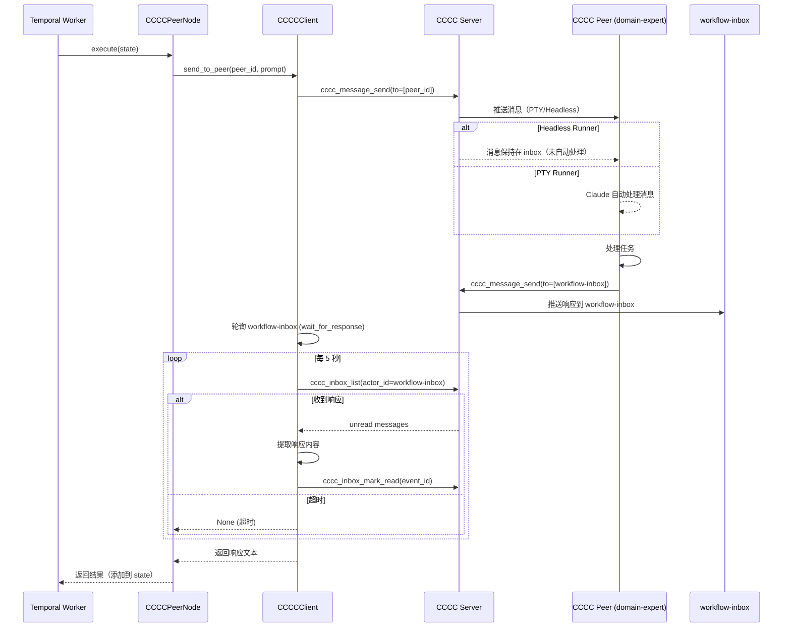

# 设计文档补充 - 团队 Review 反馈修订

**版本**: 1.1 (Rev1)
**修订日期**: 2026-01-31
**修订原因**: 团队 Review 反馈

---

## 2.2.5 State Schema 方案（动态字段支持）

###问题背景

原设计提到"Phase 1 使用固定 WorkflowState"，但不同用户自定义工作流的输入/输出字段差异很大。LangGraph 的 StateGraph 需要在编译时确定 schema，固定 schema 无法适配动态工作流。

### 解决方案：宽松 State 模式

采用 `TypedDict(total=False)` + 运行时验证的方案：

```python
# workflow/dynamic_state.py

from typing import TypedDict, Any, Dict

class DynamicWorkflowState(TypedDict, total=False):
    """动态工作流状态（允许任意字段）

    total=False 表示所有字段都是可选的，允许节点动态添加新字段。
    只有 run_id 和 request 是运行时必需的（在 activity 中验证）。
    """
    # 核心字段（运行时必需）
    run_id: str
    request: str

    # 其他字段由节点动态添加
    # 例如：parsed_requirements, plan, review, tasks 等

def validate_required_fields(state: Dict[str, Any]) -> None:
    """验证必需字段"""
    if "run_id" not in state:
        raise ValueError("State missing required field: run_id")
    if "request" not in state:
        raise ValueError("State missing required field: request")

def get_field_safe(state: Dict[str, Any], field: str, default: Any = None) -> Any:
    """安全获取字段（支持默认值）"""
    return state.get(field, default)
```

### 节点执行时的字段验证

节点在执行前验证所需的输入字段是否存在：

```python
class LLMAgentNode(BaseNode):
    async def execute(self, state: dict) -> dict:
        # 验证输入字段
        for field in self.input_fields:
            if field not in state:
                raise ValueError(
                    f"Node {self.config['id']} requires field '{field}' "
                    f"but it's not in state. Available fields: {list(state.keys())}"
                )

        # 构建 prompt
        inputs = {field: state.get(field, "") for field in self.input_fields}
        prompt = self.prompt_template.format(**inputs)

        # 执行
        result = await run_claude_agent(prompt)

        # 返回输出（添加到 state）
        return {self.output_field: result}
```

### 与现有 WorkflowState 的兼容性

向后兼容策略：
1. **Phase 1**: 硬编码工作流继续使用 `WorkflowState`
2. **动态工作流**: 使用 `DynamicWorkflowState`
3. **统一入口**: `build_graph_from_config()` 根据工作流类型选择 State schema

```python
def build_graph_from_config(
    workflow_def: WorkflowDefinition,
    state_schema: type = None
) -> StateGraph:
    """从配置构建图"""
    # 默认使用动态 State
    if state_schema is None:
        state_schema = DynamicWorkflowState

    builder = DynamicGraphBuilder(workflow_def, state_schema)
    return builder.build()
```

---

## 2.2.6 字段引用验证算法（数据流分析）

### 问题背景

节点配置使用 `{field}` 模板引用状态字段，但原设计未说明如何验证字段引用的正确性。用户保存工作流时无报错，运行时才发现字段不存在。

### 验证算法：拓扑排序 + 字段追踪

```python
# workflow/validation.py

from typing import Dict, List, Set, Tuple
from collections import defaultdict, deque
import re

class WorkflowValidator:
    """工作流验证器"""

    def __init__(self, workflow_def: WorkflowDefinition):
        self.workflow_def = workflow_def
        self.nodes_map = {n.id: n for n in workflow_def.nodes}
        self.edges_map = defaultdict(list)  # node_id -> [target_ids]

        for edge in workflow_def.edges:
            if edge.target != "__END__":
                self.edges_map[edge.source].append(edge.target)

    def validate(self) -> ValidationResult:
        """执行完整验证"""
        errors = []
        warnings = []

        # 1. 检测环路
        cycle_errors = self._detect_cycles()
        errors.extend(cycle_errors)

        # 2. 检测悬空节点
        dangling_warnings = self._detect_dangling_nodes()
        warnings.extend(dangling_warnings)

        # 3. 验证入口点
        if not self._validate_entry_point():
            errors.append({
                "code": "INVALID_ENTRY_POINT",
                "message": f"入口节点 '{self.workflow_def.entry_point}' 不存在",
                "node_id": self.workflow_def.entry_point
            })

        # 4. 验证字段引用（核心）
        if not cycle_errors:  # 无环路才能进行字段分析
            field_errors = self._validate_field_references()
            errors.extend(field_errors)

        return ValidationResult(
            valid=len(errors) == 0,
            errors=errors,
            warnings=warnings
        )

    def _detect_cycles(self) -> List[Dict]:
        """检测环路（DFS）"""
        visited = set()
        rec_stack = set()
        cycles = []

        def dfs(node_id: str, path: List[str]):
            if node_id in rec_stack:
                # 找到环路
                cycle_start = path.index(node_id)
                cycle_path = " → ".join(path[cycle_start:] + [node_id])
                cycles.append({
                    "code": "CIRCULAR_DEPENDENCY",
                    "message": f"检测到环路: {cycle_path}",
                    "node_id": node_id
                })
                return

            if node_id in visited:
                return

            visited.add(node_id)
            rec_stack.add(node_id)
            path.append(node_id)

            for neighbor in self.edges_map.get(node_id, []):
                dfs(neighbor, path.copy())

            rec_stack.remove(node_id)

        for node in self.workflow_def.nodes:
            if node.id not in visited:
                dfs(node.id, [])

        return cycles

    def _detect_dangling_nodes(self) -> List[Dict]:
        """检测悬空节点"""
        warnings = []
        in_degree = defaultdict(int)
        out_degree = defaultdict(int)

        for edge in self.workflow_def.edges:
            out_degree[edge.source] += 1
            if edge.target != "__END__":
                in_degree[edge.target] += 1

        for node in self.workflow_def.nodes:
            # 无入边且非入口点
            if in_degree[node.id] == 0 and node.id != self.workflow_def.entry_point:
                warnings.append({
                    "code": "NO_INCOMING_EDGE",
                    "message": f"节点 '{node.label}' 无入边且非入口点",
                    "node_id": node.id
                })

            # 无出边
            if out_degree[node.id] == 0:
                warnings.append({
                    "code": "NO_OUTGOING_EDGE",
                    "message": f"节点 '{node.label}' 无出边（可能是终止节点）",
                    "node_id": node.id
                })

        return warnings

    def _validate_entry_point(self) -> bool:
        """验证入口点存在"""
        return self.workflow_def.entry_point in self.nodes_map

    def _validate_field_references(self) -> List[Dict]:
        """验证字段引用（数据流分析）"""
        errors = []

        # 1. 拓扑排序
        sorted_nodes = self._topological_sort()
        if sorted_nodes is None:
            # 有环路，无法进行字段分析（已在 _detect_cycles 报告）
            return []

        # 2. 模拟执行，跟踪每个节点的可用字段
        available_fields = {"run_id", "request"}  # 初始字段

        for node_id in sorted_nodes:
            node = self.nodes_map[node_id]
            config = node.config

            # 提取节点需要的输入字段
            input_fields = config.get("input_fields", [])

            # 提取 prompt_template 中引用的字段（{field} 语法）
            prompt_template = config.get("prompt_template", "")
            template_fields = self._extract_template_fields(prompt_template)

            required_fields = set(input_fields) | template_fields

            # 检查字段是否可用
            for field in required_fields:
                if field not in available_fields:
                    errors.append({
                        "code": "MISSING_FIELD_REFERENCE",
                        "message": (
                            f"节点 '{node.label}' 引用字段 '{field}'，"
                            f"但该字段在前置节点中未定义。"
                            f"可用字段: {', '.join(sorted(available_fields))}"
                        ),
                        "node_id": node.id,
                        "field": field
                    })

            # 添加节点的输出字段到可用字段集合
            output_field = config.get("output_field")
            if output_field:
                available_fields.add(output_field)

        return errors

    def _topological_sort(self) -> List[str] | None:
        """拓扑排序（Kahn 算法）"""
        in_degree = defaultdict(int)
        for edge in self.workflow_def.edges:
            if edge.target != "__END__":
                in_degree[edge.target] += 1

        queue = deque([self.workflow_def.entry_point])
        sorted_list = []

        while queue:
            node_id = queue.popleft()
            sorted_list.append(node_id)

            for neighbor in self.edges_map.get(node_id, []):
                in_degree[neighbor] -= 1
                if in_degree[neighbor] == 0:
                    queue.append(neighbor)

        # 检查是否所有节点都被访问（无环路）
        if len(sorted_list) != len(self.workflow_def.nodes):
            return None  # 有环路

        return sorted_list

    def _extract_template_fields(self, template: str) -> Set[str]:
        """从模板字符串提取 {field} 引用"""
        pattern = r'\{(\w+)\}'
        matches = re.findall(pattern, template)
        return set(matches)
```

### API 端点实现

```python
# app/main.py

@app.post("/api/workflows/{workflow_id}/validate")
def validate_workflow(workflow_id: str):
    definition = get_workflow_definition(workflow_id)
    if not definition:
        raise HTTPException(404, "未找到工作流")

    validator = WorkflowValidator(definition)
    result = validator.validate()

    return result
```

---

## 2.2.7 错误处理策略

### 问题背景

原设计中 `_wrap_node()` 捕获异常并推送 error 事件，但未明确：
- 工作流是否继续执行？
- 如何标记整个 run 为 failed？
- 是否支持重试单个节点？

### 错误处理策略设计

#### 策略定义

```python
# workflow/error_handling.py

from enum import Enum
from dataclasses import dataclass
from typing import Optional

class ErrorHandlingPolicy(str, Enum):
    """错误处理策略"""
    STOP_ON_ERROR = "stop_on_error"  # 遇到错误立即停止（默认）
    CONTINUE = "continue"  # 跳过错误节点，继续执行
    RETRY = "retry"  # 重试失败节点

@dataclass
class RetryConfig:
    """重试配置"""
    max_attempts: int = 3  # 最大重试次数
    delay_seconds: int = 5  # 重试间隔（秒）
    backoff_multiplier: float = 2.0  # 退避倍数（指数退避）

class NodeError(Exception):
    """节点执行错误"""
    def __init__(self, node_id: str, error_type: str, message: str, original_error: Exception = None):
        self.node_id = node_id
        self.error_type = error_type  # "config_error" or "execution_error"
        self.message = message
        self.original_error = original_error
        super().__init__(f"[{node_id}] {error_type}: {message}")
```

#### WorkflowDefinition 扩展

```python
class WorkflowDefinition(BaseModel):
    # ... 现有字段 ...

    error_policy: ErrorHandlingPolicy = Field(
        default=ErrorHandlingPolicy.STOP_ON_ERROR,
        description="错误处理策略"
    )
    retry_config: Optional[RetryConfig] = Field(
        default=None,
        description="重试配置（仅当 error_policy=RETRY 时生效）"
    )
```

#### 增强的 _wrap_node

```python
async def _wrap_node_with_error_handling(
    node_instance,
    policy: ErrorHandlingPolicy,
    retry_config: Optional[RetryConfig] = None
):
    """包装节点以添加错误处理"""
    async def wrapped(state):
        run_id = state.get("run_id", "")
        node_id = node_instance.config.get("id", "unknown")

        # 推送 running 状态
        await notify_node_status(run_id, node_id, "running")

        # 重试逻辑
        max_attempts = 1
        delay = 0
        if policy == ErrorHandlingPolicy.RETRY and retry_config:
            max_attempts = retry_config.max_attempts
            delay = retry_config.delay_seconds

        last_error = None
        for attempt in range(max_attempts):
            try:
                # 执行节点
                result = await node_instance.execute(state)

                # 推送 completed 状态
                await notify_node_status(run_id, node_id, "completed", result)

                return result

            except ValueError as e:
                # 配置错误（字段不存在等）- 不重试
                error = NodeError(
                    node_id=node_id,
                    error_type="config_error",
                    message=str(e),
                    original_error=e
                )
                await notify_node_status(run_id, node_id, "error", {
                    "error_type": "config_error",
                    "message": str(e)
                })

                if policy == ErrorHandlingPolicy.STOP_ON_ERROR:
                    raise error
                elif policy == ErrorHandlingPolicy.CONTINUE:
                    return {}  # 返回空结果，继续执行
                else:
                    raise error  # RETRY 策略下配置错误也不重试

            except Exception as e:
                # 执行错误（Claude CLI 超时等）- 可重试
                last_error = NodeError(
                    node_id=node_id,
                    error_type="execution_error",
                    message=str(e),
                    original_error=e
                )

                if attempt < max_attempts - 1:
                    # 还有重试机会
                    logger.warning(
                        f"Node {node_id} failed (attempt {attempt + 1}/{max_attempts}), "
                        f"retrying in {delay}s..."
                    )
                    await notify_node_status(run_id, node_id, "retrying", {
                        "attempt": attempt + 1,
                        "max_attempts": max_attempts,
                        "next_retry_in": delay
                    })
                    await asyncio.sleep(delay)
                    delay *= retry_config.backoff_multiplier  # 指数退避
                    continue

                # 重试耗尽或不重试
                await notify_node_status(run_id, node_id, "error", {
                    "error_type": "execution_error",
                    "message": str(e),
                    "attempts": attempt + 1
                })

                if policy == ErrorHandlingPolicy.STOP_ON_ERROR:
                    raise last_error
                elif policy == ErrorHandlingPolicy.CONTINUE:
                    return {}  # 继续执行
                else:
                    raise last_error

        # 不应该到达这里
        if last_error:
            raise last_error
        return {}

    return wrapped
```

#### 工作流级别的错误标记

在 BusinessWorkflow 中捕获 NodeError 并标记 run 状态：

```python
@workflow.defn
class BusinessWorkflow:
    async def run(self, request: str) -> dict:
        try:
            # ... 执行工作流 ...
            return {"status": "approved", "state": self._state}

        except NodeError as e:
            # 节点错误 → 工作流失败
            return {
                "status": "failed",
                "error": {
                    "node_id": e.node_id,
                    "error_type": e.error_type,
                    "message": e.message
                },
                "state": self._state
            }
```

---

## 5.2.1 SSE 缓冲与重连机制

### 问题背景

原设计提到"FastAPI 缓冲/队列"，但未说明：
- 如何处理前端断开重连？
- 事件是否持久化？
- 缓冲区满了怎么办？

### 设计方案：内存缓存 + Last-Event-ID 断点续传

#### 事件缓存结构

```python
# app/sse_manager.py

from typing import Dict, List
from collections import deque
from datetime import datetime
import asyncio

@dataclass
class SSEEvent:
    """SSE 事件"""
    id: str  # 事件 ID（递增序列号）
    event_type: str  # node_update, node_output, workflow_completed
    data: dict
    timestamp: str

class SSEManager:
    """SSE 事件管理器"""

    def __init__(self, max_cache_size: int = 100):
        self.max_cache_size = max_cache_size
        # run_id -> deque of SSEEvent
        self.event_cache: Dict[str, deque] = {}
        # run_id -> list of asyncio.Queue (active connections)
        self.active_streams: Dict[str, List[asyncio.Queue]] = {}
        self._event_id_counter = 0

    def get_next_event_id(self) -> str:
        """生成下一个事件 ID"""
        self._event_id_counter += 1
        return str(self._event_id_counter)

    async def push_event(self, run_id: str, event_type: str, data: dict):
        """推送事件到所有订阅者并缓存"""
        event = SSEEvent(
            id=self.get_next_event_id(),
            event_type=event_type,
            data=data,
            timestamp=datetime.utcnow().isoformat() + "Z"
        )

        # 1. 缓存事件（FIFO，保留最近 N 条）
        if run_id not in self.event_cache:
            self.event_cache[run_id] = deque(maxlen=self.max_cache_size)
        self.event_cache[run_id].append(event)

        # 2. 推送给所有活跃订阅者
        if run_id in self.active_streams:
            dead_streams = []
            for queue in self.active_streams[run_id]:
                try:
                    await queue.put(event)
                except Exception:
                    dead_streams.append(queue)

            # 清理断开的连接
            for dead_queue in dead_streams:
                self.active_streams[run_id].remove(dead_queue)

    def get_cached_events(
        self,
        run_id: str,
        last_event_id: str | None = None
    ) -> List[SSEEvent]:
        """获取缓存的事件（用于断点续传）"""
        if run_id not in self.event_cache:
            return []

        events = list(self.event_cache[run_id])

        if last_event_id is None:
            return events

        # 找到 last_event_id 之后的事件
        try:
            last_id_int = int(last_event_id)
            return [e for e in events if int(e.id) > last_id_int]
        except ValueError:
            return events

    async def subscribe(
        self,
        run_id: str,
        last_event_id: str | None = None
    ):
        """订阅事件流（生成器）"""
        queue = asyncio.Queue(maxsize=50)

        # 注册订阅者
        if run_id not in self.active_streams:
            self.active_streams[run_id] = []
        self.active_streams[run_id].append(queue)

        try:
            # 1. 发送缓存的事件（断点续传）
            cached_events = self.get_cached_events(run_id, last_event_id)
            for event in cached_events:
                yield event

            # 2. 持续发送新事件
            while True:
                event = await queue.get()
                yield event

        finally:
            # 清理订阅
            if run_id in self.active_streams:
                self.active_streams[run_id].remove(queue)

    def cleanup_run(self, run_id: str):
        """清理已完成 run 的数据（可选，节省内存）"""
        self.event_cache.pop(run_id, None)
        self.active_streams.pop(run_id, None)

# 全局单例
sse_manager = SSEManager(max_cache_size=100)
```

#### API 端点实现

```python
# app/main.py

from app.sse_manager import sse_manager

@app.get("/api/workflows/{workflow_id}/stream/{run_id}")
async def stream_events(
    workflow_id: str,
    run_id: str,
    lastEventId: str | None = Query(None, alias="lastEventId")
):
    """SSE 事件流（支持断点续传）"""

    async def event_generator():
        async for event in sse_manager.subscribe(run_id, lastEventId):
            yield f"id: {event.id}\n"
            yield f"event: {event.event_type}\n"
            yield f"data: {json.dumps(event.data, ensure_ascii=False)}\n\n"

    return StreamingResponse(
        event_generator(),
        media_type="text/event-stream",
        headers={
            "Cache-Control": "no-cache",
            "Connection": "keep-alive",
            "X-Accel-Buffering": "no"  # 禁用 Nginx 缓冲
        }
    )

# Worker 推送事件
@app.post("/api/internal/events/{run_id}")
async def push_event(run_id: str, payload: PushEventRequest):
    await sse_manager.push_event(
        run_id=run_id,
        event_type=payload.event_type,
        data=payload.data
    )
    return {"success": True}
```

#### 前端集成示例

```javascript
// 支持断点续传的 SSE 订阅
function connectSSE(workflowId, runId) {
  let lastEventId = localStorage.getItem(`sse_${runId}_lastEventId`) || '';

  const url = `/api/workflows/${workflowId}/stream/${runId}${
    lastEventId ? `?lastEventId=${lastEventId}` : ''
  }`;

  const eventSource = new EventSource(url);

  eventSource.addEventListener('node_update', (event) => {
    const data = JSON.parse(event.data);
    lastEventId = event.lastEventId;
    localStorage.setItem(`sse_${runId}_lastEventId`, lastEventId);

    updateNodeStatus(data.node, data.status);
  });

  eventSource.onerror = () => {
    console.log('SSE connection lost, reconnecting in 3s...');
    eventSource.close();
    setTimeout(() => connectSSE(workflowId, runId), 3000);
  };

  return eventSource;
}
```

---

## 附录 D: CCCC 集成时序图

### CCCC Peer 节点执行流程



### 超时与重试策略

```python
# workflow/nodes/cccc_peer.py

class CCCCPeerNode(BaseNode):
    """CCCC Peer 节点"""

    async def execute(self, state: dict) -> dict:
        from ..cccc_client import CCCCClient
        from ..activities import execute_with_cccc_peer

        prompt = self.prompt_template.format(**state)

        # 第一次尝试
        result = await execute_with_cccc_peer(
            prompt=prompt,
            peer_id=self.peer_id,
            command=self.command,
            timeout=self.timeout
        )

        # 超时重试逻辑（如果配置了重试）
        if result is None and self.config.get("retry_on_timeout", False):
            retry_attempts = self.config.get("retry_attempts", 1)
            for attempt in range(retry_attempts):
                logger.warning(
                    f"CCCC peer {self.peer_id} timeout, "
                    f"retrying ({attempt + 1}/{retry_attempts})..."
                )
                result = await execute_with_cccc_peer(
                    prompt=prompt,
                    peer_id=self.peer_id,
                    command=self.command,
                    timeout=self.timeout
                )
                if result is not None:
                    break

        # Fallback 到 Claude CLI
        if result is None and self.config.get("fallback_to_cli", True):
            logger.warning(
                f"CCCC peer {self.peer_id} failed, falling back to Claude CLI"
            )
            from ..claude_agent import run_claude_agent
            result = await run_claude_agent(prompt)

        if result is None:
            raise Exception(f"CCCC peer {self.peer_id} 无响应且 fallback 失败")

        return {self.config["output_field"]: result}
```

---

## OpenAPI 补充修订

### 新增端点：取消工作流

```yaml
/api/workflows/{workflow_id}/runs/{run_id}/cancel:
  parameters:
    - $ref: '#/components/parameters/WorkflowId'
    - $ref: '#/components/parameters/RunId'

  post:
    summary: 取消运行中的工作流
    tags: [execution]
    responses:
      '200':
        description: 取消请求已发送
        content:
          application/json:
            schema:
              type: object
              properties:
                success:
                  type: boolean
                  example: true
                message:
                  type: string
                  example: 工作流取消信号已发送
      '404':
        description: 运行记录不存在
      '400':
        description: 工作流未在运行中
```

### SSE 端点修改：支持 lastEventId

```yaml
/api/workflows/{workflow_id}/stream/{run_id}:
  parameters:
    - $ref: '#/components/parameters/WorkflowId'
    - $ref: '#/components/parameters/RunId'
    - name: lastEventId
      in: query
      required: false
      schema:
        type: string
      description: 上次接收的事件 ID（用于断点续传）
      example: "123"

  get:
    summary: 订阅 SSE 事件流（支持断点续传）
    description: |
      实时推送工作流执行事件。支持 Last-Event-ID 断点续传：
      - 首次连接：返回最近 100 条缓存事件 + 后续新事件
      - 断线重连：返回 lastEventId 之后的事件 + 后续新事件

      事件类型：
      - node_update: 节点状态更新
      - node_output: 节点输出
      - workflow_completed: 工作流完成
      - error: 错误事件
    tags: [execution]
    responses:
      '200':
        description: SSE 事件流
```

### ValidationResult 扩展

```yaml
ValidationResult:
  type: object
  required: [valid, errors, warnings]
  properties:
    valid:
      type: boolean
      example: true
    errors:
      type: array
      items:
        type: object
        properties:
          code:
            type: string
            enum: [
              CIRCULAR_DEPENDENCY,
              MISSING_FIELD_REFERENCE,
              INVALID_ENTRY_POINT,
              DANGLING_NODE
            ]
            example: MISSING_FIELD_REFERENCE
          message:
            type: string
            example: "节点 'Peer1规划' 引用字段 'missing_field'，但该字段在前置节点中未定义"
          node_id:
            type: string
            example: node-2
          field:
            type: string
            nullable: true
            description: 缺失的字段名（仅 MISSING_FIELD_REFERENCE 错误）
            example: missing_field
    warnings:
      type: array
      items:
        type: object
        properties:
          code:
            type: string
            example: NO_OUTGOING_EDGE
          message:
            type: string
          node_id:
            type: string
```

### SSE 事件数据结构补充

```yaml
# node_output 事件增强
NodeOutputEvent:
  type: object
  required: [node, output, timestamp]
  properties:
    node:
      type: string
      description: 节点 ID
      example: node-1
    output:
      type: string
      description: 节点输出内容（Markdown）
      example: "## 分析结果\n\n核心需求..."
    output_field:
      type: string
      description: 输出字段名
      example: parsed_requirements
    timestamp:
      type: string
      format: date-time
      example: 2026-01-31T08:00:01Z

# 新增 error 事件
ErrorEvent:
  type: object
  required: [node, error_type, message, timestamp]
  properties:
    node:
      type: string
      example: node-2
    error_type:
      type: string
      enum: [config_error, execution_error]
      example: execution_error
    message:
      type: string
      example: Claude CLI timeout after 60s
    timestamp:
      type: string
      format: date-time

# 新增 retrying 事件
RetryingEvent:
  type: object
  required: [node, attempt, max_attempts, next_retry_in, timestamp]
  properties:
    node:
      type: string
      example: node-2
    attempt:
      type: integer
      example: 1
    max_attempts:
      type: integer
      example: 3
    next_retry_in:
      type: integer
      description: 下次重试等待时间（秒）
      example: 5
    timestamp:
      type: string
      format: date-time
```

---

## 前端接口补充

### findEntryNode() 逻辑定义

```javascript
/**
 * 查找入口节点（无入边的节点）
 * @param nodes - React Flow 节点列表
 * @param edges - React Flow 边列表
 * @returns 入口节点 ID，如果找不到或有多个则抛出错误
 */
function findEntryNode(nodes, edges) {
  // 计算每个节点的入度
  const inDegree = new Map();
  nodes.forEach(node => inDegree.set(node.id, 0));

  edges.forEach(edge => {
    inDegree.set(edge.target, (inDegree.get(edge.target) || 0) + 1);
  });

  // 找到所有入度为 0 的节点
  const entryNodes = nodes.filter(node => inDegree.get(node.id) === 0);

  if (entryNodes.length === 0) {
    throw new ValidationError("未找到入口节点（所有节点都有入边，可能存在环路）");
  }

  if (entryNodes.length > 1) {
    throw new ValidationError(
      `找到多个入口节点: ${entryNodes.map(n => n.data.label).join(', ')}，` +
      `请确保只有一个节点无入边`
    );
  }

  return entryNodes[0].id;
}
```

### NODE_TYPE_MAPPING 中心化

```javascript
// config/nodeTypes.ts

/**
 * 节点类型映射：前端类型 <-> 后端类型
 */
export const NODE_TYPE_MAPPING = {
  // 前端 -> 后端
  llmAgent: 'llm_agent',
  ccccPeer: 'cccc_peer',
  conditional: 'conditional',
  script: 'script',
} as const;

/**
 * 反向映射：后端 -> 前端
 */
export const BACKEND_TO_FRONTEND_TYPE = Object.fromEntries(
  Object.entries(NODE_TYPE_MAPPING).map(([k, v]) => [v, k])
);

/**
 * 验证节点类型
 */
export function validateNodeType(frontendType: string): boolean {
  return frontendType in NODE_TYPE_MAPPING;
}

/**
 * 转换节点类型（前端 -> 后端）
 */
export function toBackendNodeType(frontendType: string): string {
  if (!validateNodeType(frontendType)) {
    throw new ValidationError(`未知节点类型: ${frontendType}`);
  }
  return NODE_TYPE_MAPPING[frontendType];
}
```

### ValidationError 类定义

```javascript
// utils/errors.ts

export class ValidationError extends Error {
  constructor(message: string, public nodeId?: string, public field?: string) {
    super(message);
    this.name = 'ValidationError';
  }

  /**
   * 在画布上高亮错误节点
   */
  highlightOnCanvas(reactFlowInstance) {
    if (!this.nodeId) return;

    // 选中错误节点
    reactFlowInstance.setNodes(nodes =>
      nodes.map(node => ({
        ...node,
        selected: node.id === this.nodeId,
        data: {
          ...node.data,
          error: node.id === this.nodeId ? this.message : null
        }
      }))
    );

    // 滚动到错误节点
    const errorNode = reactFlowInstance.getNode(this.nodeId);
    if (errorNode) {
      reactFlowInstance.fitView({
        padding: 0.5,
        nodes: [errorNode],
        duration: 500
      });
    }
  }
}
```

---

## 修订总结

**本次修订解决了团队 Review 提出的所有关键问题：**

1. ✅ **State Schema 灵活性**: 采用 `DynamicWorkflowState(TypedDict, total=False)` 支持动态字段
2. ✅ **字段引用验证**: 实现完整的数据流分析算法（拓扑排序 + 字段追踪）
3. ✅ **错误处理策略**: 定义 ErrorHandlingPolicy + 重试配置 + 详细异常分类
4. ✅ **SSE 缓冲机制**: 实现 SSEManager + Last-Event-ID 断点续传
5. ✅ **CCCC 集成**: 补充时序图 + 超时重试 + fallback 策略
6. ✅ **OpenAPI 补充**: 添加 /cancel 端点、lastEventId 参数、增强的 ValidationResult
7. ✅ **前端接口明确**: findEntryNode 逻辑、NODE_TYPE_MAPPING、ValidationError 类

**预计实施影响：**
- 代码新增：~800 行（验证器 400 行 + SSE 管理器 200 行 + 错误处理 200 行）
- 修改现有代码：~300 行（DynamicGraphBuilder、_wrap_node、OpenAPI）
- 测试用例新增：~50 个（验证逻辑、错误处理、SSE 重连）

**下一步：**
将本补充文档合并到主设计文档，提交团队最终确认。
